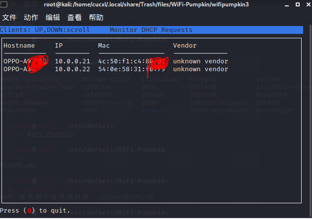

2022.2.11进展汇报

评价指标，对被教育用户打分，淡化工具，重视指标

一. 无线攻击

wifi pumpkin3 实现构建无线热点，获取低安全用户活动，获取低安全意识用户信息：

选择这个模块是因为查阅资料发现这个模块文档较为详细，支持docker打包，支持Debian/Ubuntu等多种系统，易于移植扩展。并且API接口说明齐全，适合在此基础上进一步开发完善。

已完成以下测试，后续会使用docker制作镜像，根据文档里的API接口实现无线网络的移动办公场景下的攻击，配合进行网络安全教育意识软件的开发。
1. 安装
```bash
 $ sudo apt install libssl-dev libffi-dev build-essential
 $ git clone https://github.com/P0cL4bs/wifipumpkin3.git
 $ cd wifipumpkin3

 $ sudo python3 setup.py install
 ##缺少依赖自行安装，仅支持Python3.Kali自带有。

```
2. 运行
```bash
set interface wlan0 
##我的是wlan0,这里填网卡名称 
set ssid cuc-wifi
##热点名
set proxy noproxy
##禁用代理
ignore pydns_server
##DNS忽略日志
start
##启动
```


使用clients可以查看低安全意识用户信息




用户正常上网不受影响


3. docker

支持docker制作镜像

```bash
$ sudo docker-compose run wifipumpkin3 wifipumpkin3

##To run a container with a pulp file

$ sudo docker-compose run wifipumpkin3 wifipumpkin3 --pulp scripts/demo.pulp
```

4. 自动化

```bash
sudo wifipumpkin3 --pulp /path/to/cucwifi.pulp
##cuc-wifi是文件名。pulp格式文件自动化运行，自动出结果
```


5. 登录认证

支持自主定义登录界面


攻击者攻击


6. DNS攻击，中间人攻击，重放攻击也支持


二. 蜜罐搭建

在云主机上搭建蜜罐，在遭受攻击时分析日志并录入MySQL数据库，用做后续用户网络安全意识的评估

1. Pentbox是一个轻量级的软件，允许你打开你的主机端口，监听从外部传入的连接请求（最终是拒绝的）

```bash
wget http://downloads.sourceforge.net/project/pentbox18realised/pentbox-1.8.tar.gz

tar zxvf pentbox-1.8.tar.gz
##下载解压
cd pentbox-1.8
./pentbox.rb
##进入运行
```


2. 使用蜜罐模式可以检测访问者并拒绝接入


三. 云服务器还在配置

云服务器ssh登不上去，原因在排查。


数据库可以访问


ftp可以上传文件


四. 下一步计划，开始

tips:
1. kali里git clone出现以下错误：GnuTLS recv error (-54): Error in the pull function.
将https改为git就可以了
2. PenTBox基于Ruby开发，Ubuntu使用需要配置Ruby环境

收集数据，评价，数据分析，可视化